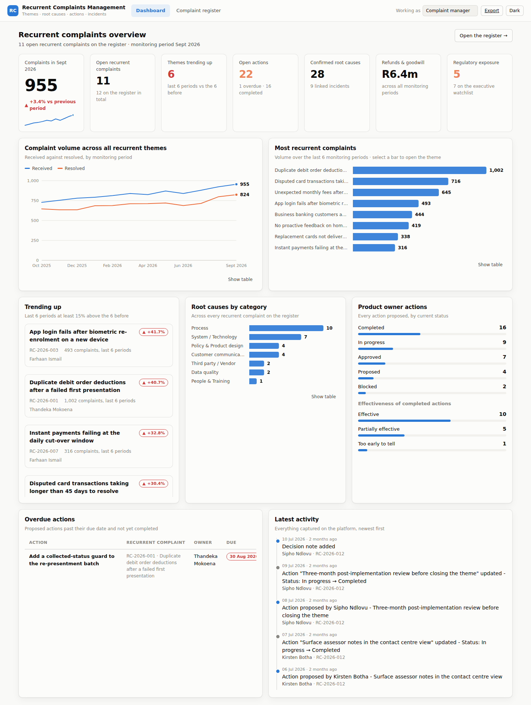

# Recurrent Complaints Management

A platform for tracking the complaints that keep coming back — not individual customer
cases, but the **recurrent complaint themes** the bank monitors month after month, together
with everything that explains them: the volume history, the root causes, the actions
product owners have proposed, the incidents that caused or worsened them, and a full audit
trail of who recorded what.

Built for the complaint manager: every screen can be edited in place, so new information
goes in as it arrives rather than waiting for a spreadsheet cycle.

**[Open the interactive demo](https://claude.ai/code/artifact/150bf38f-78db-4af6-b427-4f688c4c31fb)** — the full interface in your browser, nothing to
install. It runs the real application code against a register held in memory, so every
form, validation rule and audit-trail entry behaves exactly as it does locally. Nothing is
saved; reload for a clean register.



_More screens: [the register](docs/screenshots/register.png) · [a recurrent complaint in detail](docs/screenshots/complaint-detail.png)_

## What it tracks

| | |
|---|---|
| **Recurrent complaint themes** | The recurring issue itself — product, channel, category, severity, status, product owner, complaint manager, regulatory exposure, watchlist flag, target close date. |
| **Monitoring history** | One entry per reporting period: complaints received and resolved, average days to resolve, repeat complainants, refunds and goodwill paid. This is the record that makes a complaint "recurrent" and drives every trend on the platform. |
| **Root causes** | What is actually causing the complaints — categorised, with a confidence level (suspected → confirmed), the share of complaints attributed to each, the evidence behind the finding, and who identified it. |
| **Actions proposed by product owners** | The full history of the action plan: who proposed what, when, against which root cause, its priority, due date, current status, and — once it is live — whether it actually worked. |
| **Related incidents** | Operational incidents linked to the theme, with severity, dates, systems and customers affected, and a link to the post-incident review. |
| **Notes** | Free-form input from the complaint manager: escalations, forum decisions, regulatory correspondence, customer wording. |
| **Full history** | An append-only audit trail. Every create, update and delete is recorded with a field-level diff and the name of the person who made it. |

## Running it

**Node 18 or later. Nothing to install** — no dependencies, no build step, no database
server. The backend is Node's built-in HTTP server; the front end is plain ES modules.

```bash
npm run check     # confirms your machine can run it, and explains anything that can't
npm run seed      # load the demo register (12 recurrent complaints, 18 months of history)
npm start         # http://localhost:4173
```

```bash
npm test          # 36 tests, no fixtures or services needed
npm run reset     # wipe and reload the demo data
npm run dev       # restart on file change (Node 18.11+)
```

The register lives in one readable JSON file at `data/complaints.json` (override with
`RCM_DB_PATH`). Port is `4173` by default (override with `PORT`). The file is gitignored,
so your entries stay on your machine.

Starting empty instead: skip `npm run seed` and register your first recurrent complaint
from the register screen.

**Working in VS Code?** Press `F5` to run it with the debugger attached. Step-by-step
instructions, including how to get Node without admin rights, are in
**[SETUP.md](SETUP.md)**.

## How it is put together

```
server/
  index.js       HTTP server: static files + /api dispatch, path-traversal guard, 1 MB body cap
  store.js       The whole storage layer - records in memory, persisted as one JSON file
  api.js         REST routing. Child collections are generated from one table of specs
  repository.js  Queries, roll-ups, trend derivation, the activity log and its diffing
  schemas.js     Per-entity field specs - the single source of truth for validation
  validate.js    Spec-driven coercion and validation; partial mode for PATCH
  reference.js   Controlled vocabularies (statuses, categories, severities…)
  seed.js        Demo dataset
scripts/check.js Environment check behind `npm run check`
web/
  index.html     App shell
  css/app.css    Design tokens; light and dark both explicitly defined
  js/charts.js   SVG charts - line, bar, distribution, sparkline - with hover and table views
  js/ui.js       Modal, declarative form builder, confirm dialog, toasts
  js/views/      Dashboard, register, theme detail
demo/            The hosted demo: an in-memory store and a fetch-free API client
tests/           api.test.js, store.test.js
docs/DATA_MODEL.md
.vscode/         F5 to run, Command Palette tasks for seed / test / reset
```

The hosted demo is built from this same code (`npm run demo:build`). It publishes the real
front end and the real server modules, substituting only the two pieces that assume a
server - the store and the API client - so the demo cannot drift from the platform.

Adding a field is a three-line change: add the column in `db.js`, the rule in `schemas.js`,
and the input in `web/js/forms.js`. Adding a dropdown value is one line in `reference.js` —
the API validates against it and the UI picks it up automatically.

## Notes on the design

**Trend is computed, not typed.** A theme's trend compares complaint volume over the last
six reporting periods against the six before it. ±15% is the band for "stable". Nobody sets
a trend by hand, so nobody can set it wrong.

**Every write names a person.** The "Working as" field in the header is recorded against
every entry, and the history shows field-level before/after. On a register that feeds
regulatory reporting, "who said this and when" matters as much as the value itself.

**Actions are linked to root causes.** An action not linked to a cause is flagged in the
UI, and so is a root cause with no action against it — the two most common ways an action
plan quietly stops addressing the problem.

**Storage is one module.** Records are held in memory and saved to a single JSON file,
written to a temporary file and renamed over the target so an interrupted save cannot
leave a half-written register behind. At the scale of a complaints register — hundreds of
records — querying in JavaScript is fast, and it keeps the platform running on any Node 18
with nothing to install. Moving to a real database means reimplementing `server/store.js`;
nothing above it touches storage directly.

**Charts follow one measure per axis.** Complaints received and resolved share a scale and
share a chart; average days to resolve is a different measure, so it gets its own. Every
chart has a legend, a hover readout and a table view, so no value is reachable only by
hovering.

See `docs/DATA_MODEL.md` for the schema and the API surface.

## Where it would go next

This runs as a single-process app with no authentication — it is a working platform, not a
production deployment. Before it carried real customer data it would need, at minimum:
SSO and role-based access (complaint manager, product owner, read-only executive), a
managed database rather than a local file (see "Storage is one module" above), and
retention rules for anything customer-identifying. The data model and API are shaped to
take those without restructuring.
