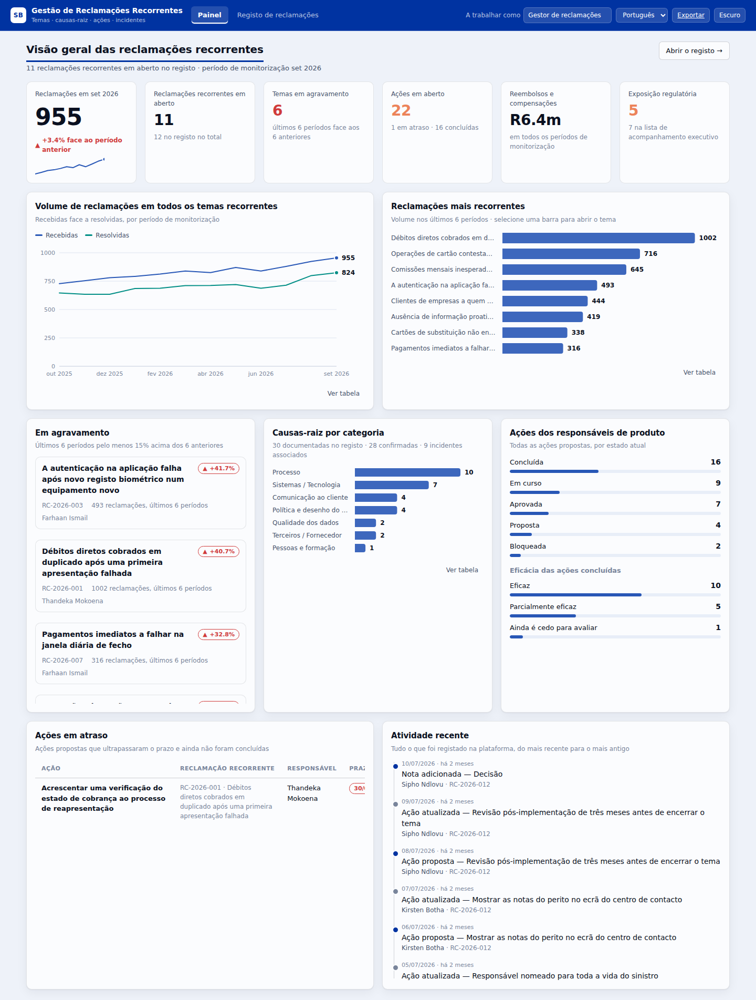

# Gestão de Reclamações Recorrentes

*[English version](README.md)*

Uma plataforma para acompanhar as reclamações que voltam sempre — não casos
individuais de clientes, mas os **temas de reclamação recorrente** que o banco
monitoriza mês após mês, juntamente com tudo o que os explica: o histórico de
volume, as causas-raiz, as ações propostas pelos responsáveis de produto, os
incidentes que os causaram ou agravaram, e um registo completo de quem
introduziu o quê.

Feita para o gestor de reclamações: todos os ecrãs são editáveis no momento,
para que a informação nova entre à medida que chega e não no fecho do mês.

**[Abrir a demonstração interativa](https://claude.ai/code/artifact/150bf38f-78db-4af6-b427-4f688c4c31fb)** —
a interface completa no navegador, sem instalar nada.



## O que acompanha

| | |
|---|---|
| **Temas de reclamação recorrente** | O problema recorrente em si — produto, canal, categoria, gravidade, estado, responsável de produto, gestor de reclamações, exposição regulatória, lista de acompanhamento, data-alvo de encerramento. |
| **Histórico de monitorização** | Um registo por período: reclamações recebidas e resolvidas, dias médios de resolução, reclamantes repetidos, reembolsos e compensações pagos. É este registo que torna uma reclamação "recorrente" e que alimenta todas as tendências. |
| **Causas-raiz** | O que está realmente a causar as reclamações — categorizado, com grau de confiança (suspeita → confirmada), a percentagem de reclamações atribuída a cada uma, a evidência por trás e quem a identificou. |
| **Ações propostas pelos responsáveis de produto** | O histórico completo do plano de ação: quem propôs o quê, quando, contra que causa-raiz, prioridade, prazo, estado atual e — depois de entrar em vigor — se resultou. |
| **Incidentes relacionados** | Incidentes operacionais associados ao tema, com gravidade, datas, sistemas e clientes afetados, e ligação à análise pós-incidente. |
| **Notas** | Entrada livre do gestor de reclamações: escalamentos, decisões de fórum, correspondência regulatória, expressões dos clientes. |
| **Histórico completo** | Um registo de auditoria só de acréscimos. Cada criação, alteração e eliminação fica registada com as diferenças campo a campo e o nome de quem a fez. |

## Idioma

A plataforma abre em **português (pt-PT)** e o seletor no cabeçalho muda para
inglês. Duas regras mantêm isto honesto:

1. **Os valores guardados nunca são traduzidos.** O estado de um tema é a
   cadeia `Remediation in progress` na base de dados, independentemente da
   língua em que o está a ler; só a etiqueta muda. Assim, mudar de idioma nunca
   reescreve dados, e um registo exportado em português continua a filtrar,
   importar e reportar em inglês.
2. **Datas, números e moeda seguem o idioma ativo**, não o do navegador.

O registo de demonstração existe nos dois idiomas: `npm run seed` carrega o
português, `npm run seed -- --lang=en` o inglês.

## Executar

**Node 16.17 ou posterior. Nada para instalar** — sem dependências, sem passo
de compilação, sem servidor de base de dados.

```bash
npm run check     # confirma se a máquina consegue executar
npm run seed      # carrega o registo de demonstração
npm start         # http://localhost:4173
```

Instruções passo a passo para o VS Code, incluindo como obter o Node sem
direitos de administrador e o que fazer quando um proxy de TLS bloqueia o
`git clone`, estão em **[SETUP.pt.md](SETUP.pt.md)**.

## Design

A identidade segue a do Standard Bank. O azul da marca **#0033A1** é o ponto
fixo: carrega o cabeçalho, os botões principais, as ligações e os estados
ativos. É demasiado escuro para servir de cor de série num gráfico — em OKLCH
tem L 0,38, abaixo do limiar de 0,43 a partir do qual as cores de série
permanecem legíveis — por isso as cores dos dados são degraus mais claros do
mesmo tom da marca, com o vermelho da marca ao lado. Cada par de séries foi
verificado para deficiência de visão cromática contra estas superfícies exatas,
nos temas claro e escuro.

Os neutros têm um viés para o azul da marca em vez de cinzento puro, para que
os cinzentos assentem com o azul em vez de lutarem contra ele.

A tipografia usa a pilha de sistema, deliberadamente: uma ferramenta interna de
um banco não deve depender de um servidor de tipos de letra externo que a rede
pode bloquear.

Ver `docs/DATA_MODEL.md` para o esquema e a superfície da API.
